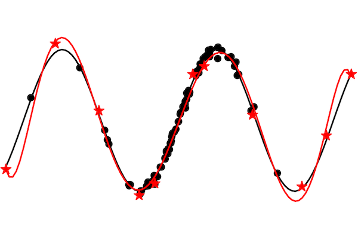

# Coresets via Bilevel Optimization



This is a reference implementation for "Coresets via Bilevel Optimization for Continual Learning and Streaming" [https://arxiv.org/pdf/2006.03875.pdf](https://arxiv.org/pdf/2006.03875.pdf). 


## Overview
To get started with the library, check out [`demo.ipynb`](https://colab.research.google.com/github/zalanborsos/bilevel_coresets/blob/main/demo.ipynb) that shows how to build coresets for a toy regression 
problem and for MNIST classification. The following snippet outlines the general usage:
```python
import bilevel_coreset
import loss_utils
import numpy as np

x, y = load_data()

# define proxy kernel function
linear_kernel_fn = lambda x1, x2: np.dot(x1, x2.T)

coreset_size = 10

coreset_constructor = bilevel_coreset.BilevelCoreset(outer_loss_fn=loss_utils.cross_entropy,
                                                    inner_loss_fn=loss_utils.cross_entropy,
                                                    out_dim=y.shape[1])
coreset_inds, coreset_weights = coreset_constructor.build_with_representer_proxy_batch(x, y, 
                                                    coreset_size, linear_kernel_fn)
x_coreset, y_coreset = x[coreset_inds], y[coreset_inds]
```

## Requirements

Python 3 is required.  To install the required dependencies, run:

```bash
pip install -r requirements.txt
```
If you are planning to use the NTK proxy, consider installing the GPU version of JAX: instructions [here](https://github.com/google/jax#installation).
If you would like to run the experiments, add the project root to your PYTHONPATH env variable.

## Continual Learning and Streaming
We showcase the usage our coreset construction in continual learning and streaming with memory replay. 
The buffer regularizer ```beta```  is tuned individually for each method. We provide the best betas 
from ```[0.01, 0.1, 1.0, 10.0, 100.0, 1000.0]``` for each method in  ```cl_results/``` and ```streaming_results/```. 

#### Running the Experiments
Change dir to ```cl_streaming```. After this, you can run individual experiments, e.g.: 
```bash
python cl.py --buffer_size 100 --dataset splitmnist --seed 0 --method coreset --beta 100.0
```

You can also run the continual learning and streaming experiments with grid search over ```beta```
on datasets derived from MNIST by adjusting the globals in ```runner.py``` to your setup and running:
```bash
python runner.py --exp cl
python runner.py --exp streaming
python runner.py --exp imbalanced_streaming
```

The table of result can be displayed by running ```python process_results.py``` 
with the corresponding ```--exp``` argument.

## Citation

If you use the code in a publication, please cite the paper:
```
@article{borsos2020coresets,
      title={Coresets via Bilevel Optimization for Continual Learning and Streaming}, 
      author={Zalán Borsos and Mojmír Mutný and Andreas Krause},
      year={2020},
      journal={arXiv preprint arXiv:2006.03875}
}
```
